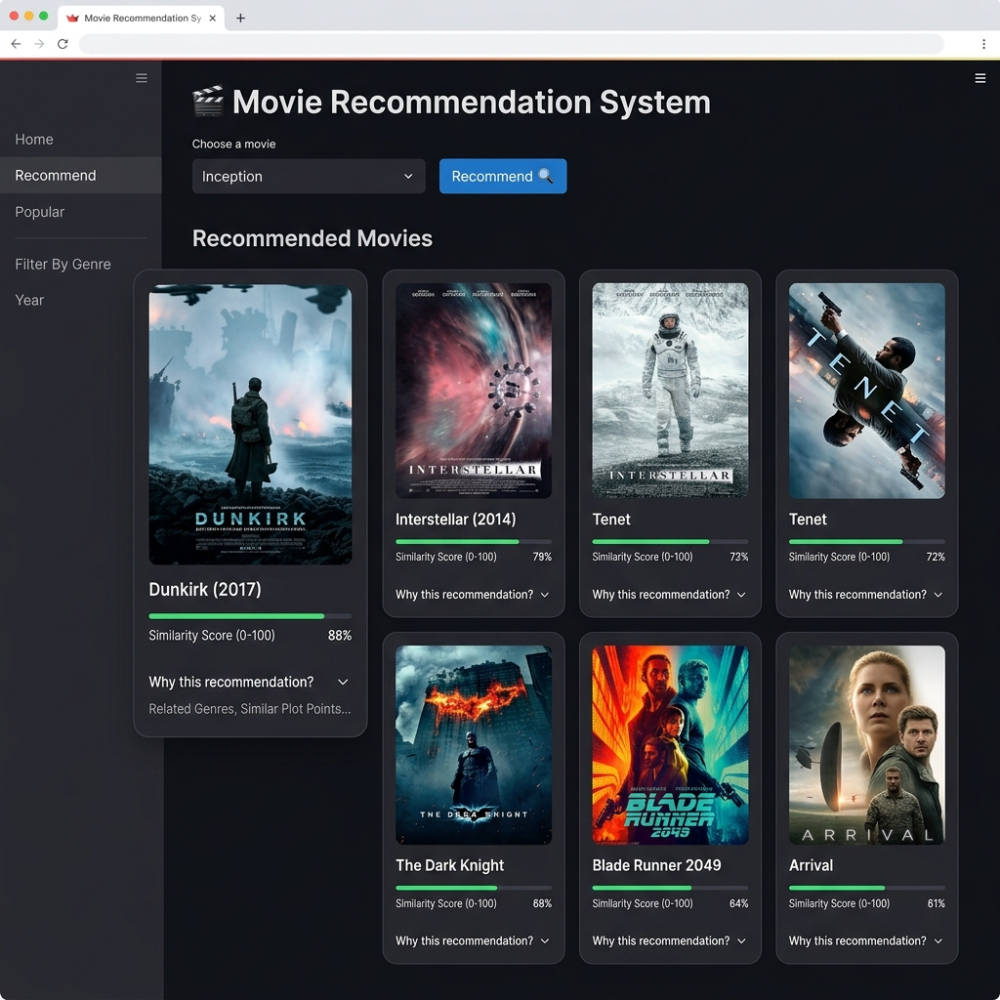

# 🎬 Movie Recommendation System

A content-based movie recommendation engine built with Python and Streamlit. Select a movie you love, and the system recommends similar films using cosine similarity — complete with posters, match scores, and human-readable explanations for every recommendation.



---

## ✨ Features

- **Content-Based Filtering** — recommendations powered by cosine similarity on movie metadata (genres, keywords, cast, crew)
- **Weighted Ranking** — blends similarity score (86%), vote average (8%), and popularity (6%) for better results
- **Explainable Results** — every recommendation includes reasons like shared genres, common themes, overlapping cast, and same director
- **Movie Posters** — dynamically fetched from TMDB API
- **Interactive UI** — clean Streamlit interface with a searchable dropdown of 4,800+ movies

---

## 🏗️ Project Structure

```
movie-recommender-ml/
├── app.py                                  # Streamlit web application
├── recommendation/
│   ├── __init__.py
│   ├── content_based/
│   │   ├── loader.py                       # Loads pre-trained models & data
│   │   ├── recommender.py                  # Core recommendation engine
│   │   └── explain.py                      # Generates human-readable explanations
│   ├── models/                             # Pre-trained artifacts (not in repo)
│   │   ├── similarity.pkl                  # Cosine similarity matrix
│   │   ├── rating.pkl                      # Normalized ratings
│   │   ├── movie_metadata.pkl              # Metadata for explanations
│   │   └── movie_titles.csv                # Movie title index
│   └── services/
│       └── poster_service.py               # TMDB poster fetcher
├── notebooks/
│   ├── system.ipynb                        # Model training & preprocessing
│   └── ranking.ipynb                       # Ranking experiments
├── datasets/                               # Raw TMDB data (not in repo)
│   ├── tmdb_5000_movies.csv
│   └── tmdb_5000_credits.csv
├── requirements.txt
├── .env.example
├── LICENSE
└── README.md
```

---

## 🚀 Getting Started

### Prerequisites

- Python 3.9+
- A [TMDB API key](https://www.themoviedb.org/settings/api) (free)

### 1. Clone the repository

```bash
git clone https://github.com/<your-username>/movie-recommender-ml.git
cd movie-recommender-ml
```

### 2. Create a virtual environment

```bash
python -m venv venv
source venv/bin/activate        # macOS / Linux
# venv\Scripts\activate         # Windows
```

### 3. Install dependencies

```bash
pip install -r requirements.txt
```

### 4. Set up environment variables

```bash
cp .env.example .env
```

Open `.env` and replace `your_api_key_here` with your actual TMDB API key.

### 5. Generate the models

Run the Jupyter notebooks in the `notebooks/` directory to generate the pre-trained model files:

```bash
jupyter notebook notebooks/system.ipynb
```

This will create the `.pkl` files in `recommendation/models/`.

> **Note:** The pre-trained model files (~179 MB) are excluded from the repository via `.gitignore`. You must generate them locally by running the notebooks with the dataset files placed in `datasets/`.

### 6. Launch the app

```bash
streamlit run app.py
```

The app will open at `http://localhost:8501`.

---

## 🧠 How It Works

1. **Data Preprocessing** — Movie metadata (genres, keywords, cast, crew) is extracted from the TMDB 5000 dataset, tokenized, and combined into feature tags
2. **Vectorization** — Feature tags are converted to vectors using Count Vectorizer
3. **Similarity Matrix** — Cosine similarity is computed between all movie pairs
4. **Recommendation** — Given a liked movie, the engine:
   - Retrieves the top similar candidates (similarity > 0.25)
   - Applies weighted scoring: `0.86 × similarity + 0.08 × rating + 0.06 × popularity`
   - Returns top-N results with posters and explanations

---

## 📊 Dataset

This project uses the [TMDB 5000 Movie Dataset](https://www.kaggle.com/datasets/tmdb/tmdb-movie-metadata) from Kaggle:
- `tmdb_5000_movies.csv` — movie metadata (genres, keywords, overview, etc.)
- `tmdb_5000_credits.csv` — cast and crew information

Download the dataset from Kaggle and place the CSV files in the `datasets/` directory.

---

## 🛠️ Tech Stack

| Component       | Technology        |
|----------------|-------------------|
| Frontend       | Streamlit         |
| Language       | Python            |
| ML Technique   | Cosine Similarity |
| Data Source    | TMDB 5000 Dataset |
| Poster API    | TMDB API          |

---

## 🤝 Contributing

Contributions are welcome! Please feel free to submit a Pull Request.

1. Fork the repository
2. Create your feature branch (`git checkout -b feature/amazing-feature`)
3. Commit your changes (`git commit -m 'Add amazing feature'`)
4. Push to the branch (`git push origin feature/amazing-feature`)
5. Open a Pull Request

---

## 📄 License

This project is licensed under the MIT License — see the [LICENSE](LICENSE) file for details.

---

## 🙏 Acknowledgements

- [TMDB](https://www.themoviedb.org/) for the movie data and poster API
- [Streamlit](https://streamlit.io/) for the web framework
- [TMDB 5000 Movie Dataset](https://www.kaggle.com/datasets/tmdb/tmdb-movie-metadata) on Kaggle
